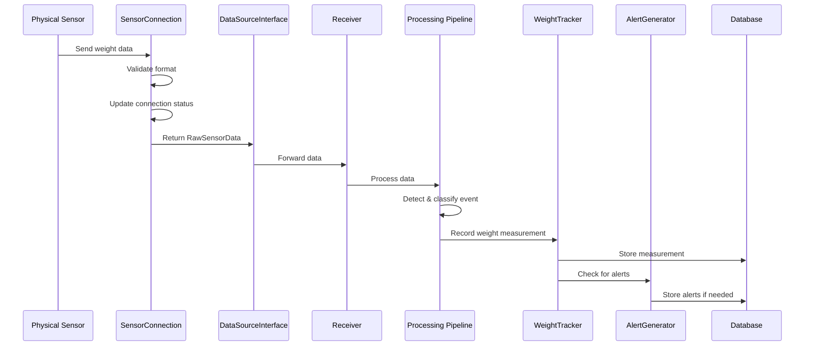
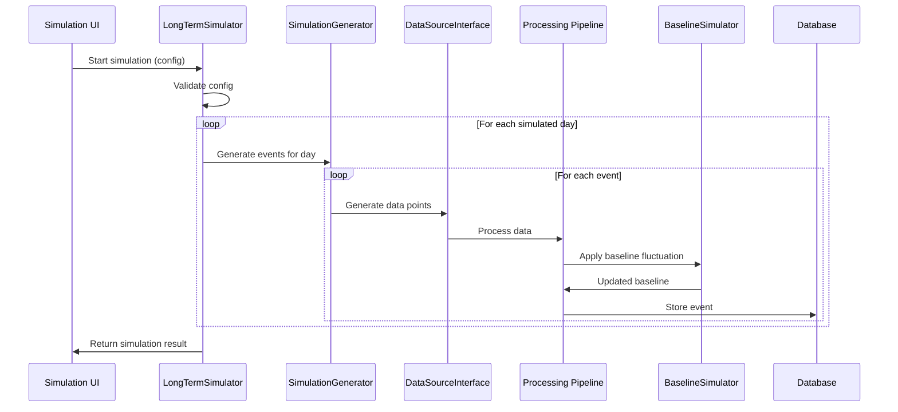
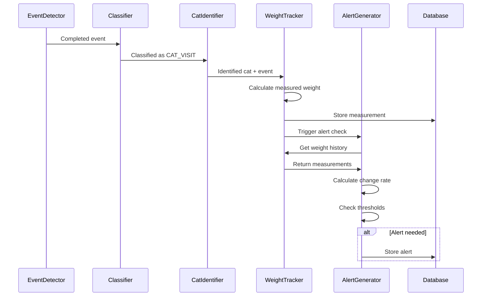

# Design Document

## Overview

This document describes the design for advanced simulation and tracking features in the Cat Health Copilot system. The design extends the existing event-based architecture to support:

1. **Weight Change Tracking**: Historical weight monitoring with trend analysis
2. **Alert Generation**: Automated health alerts based on weight changes and visit patterns
3. **Baseline Fluctuation Simulation**: Realistic litter box weight variations
4. **Long-Term Simulation**: Multi-day scenario generation for testing
5. **Real Sensor Integration**: Seamless support for both simulated and physical sensor data

The design maintains the existing data flow architecture while adding new components for tracking, simulation, and data source abstraction. The key principle is that **simulation and real sensor data flow through the same processing pipeline**, ensuring consistent behavior and simplifying testing.

### Design Principles

- **Unified Data Pipeline**: Both simulated and real sensor data use identical processing components
- **Data Source Transparency**: Processing components are agnostic to data source
- **Separation of Concerns**: Simulation logic is isolated from core processing logic
- **Extensibility**: New simulation scenarios can be added without modifying core components
- **Testability**: Simulation provides comprehensive test coverage for real sensor scenarios

## Architecture

### System Architecture Diagram

```mermaid
graph TB
    subgraph "Data Sources"
        PS[Physical Sensor]
        SIM[Simulator]
    end
    
    subgraph "Data Source Interface"
        DSI[DataSourceInterface]
        SC[SensorConnection]
        SG[SimulationGenerator]
    end
    
    subgraph "Core Processing Pipeline"
        REC[Receiver]
        PRE[Preprocessor]
        BM[BaselineManager]
        ED[EventDetector]
        CLS[Classifier]
        ID[CatIdentifier]
    end
    
    subgraph "New Components"
        WT[WeightTracker]
        AG[AlertGenerator]
        BS[BaselineSimulator]
        LTS[LongTermSimulator]
    end
    
    subgraph "Storage"
        DB[(Database)]
        WH[(WeightHistory)]
        BH[(BaselineHistory)]
    end
    
    subgraph "UI"
        UI[Streamlit UI]
        SC_UI[Simulation Config]
        WV[Weight Visualization]
    end
    
    PS -->|Real-Time Data| SC
    SIM -->|Simulated Data| SG
    SC --> DSI
    SG --> DSI
    DSI --> REC
    
    REC --> PRE
    PRE --> BM
    BM --> ED
    ED --> CLS
    CLS --> ID
    
    ID --> WT
    WT --> AG
    AG --> DB
    
    BM -.->|Baseline Changes| BS
    BS -.->|Fluctuations| BM
    
    LTS -.->|Generate Events| SG
    
    WT --> WH
    BM --> BH
    
    DB --> UI
    WH --> WV
    BH --> UI
    SC_UI --> LTS
```

### Component Responsibilities

#### Existing Components (Modified)

- **Receiver**: Accepts data from DataSourceInterface instead of direct sensor input
- **BaselineManager**: Extended to track baseline history and apply fluctuations
- **EventDetector**: No changes, processes events regardless of data source
- **Database**: Extended to store weight history, baseline history, and data source tags

#### New Components

- **DataSourceInterface**: Abstracts data source (sensor vs simulation)
- **SensorConnection**: Manages physical sensor communication and connection status
- **SimulationGenerator**: Generates simulated sensor data on demand
- **WeightTracker**: Tracks cat weight over time and calculates trends
- **AlertGenerator**: Creates health alerts based on weight changes and patterns
- **BaselineSimulator**: Simulates realistic baseline weight fluctuations
- **LongTermSimulator**: Generates multi-day simulation scenarios

## Components and Interfaces

### 1. DataSourceInterface

**Purpose**: Provide uniform access to weight data regardless of source (sensor or simulation).

**Interface**:
```python
class DataSourceMode(Enum):
    SIMULATION = "simulation"
    SENSOR = "sensor"

class DataSourceInterface:
    def __init__(self):
        self.mode: DataSourceMode
        self.sensor_connection: Optional[SensorConnection]
        self.simulation_generator: Optional[SimulationGenerator]
    
    def set_mode(self, mode: DataSourceMode) -> None:
        """Switch between sensor and simulation mode"""
    
    def get_data(self) -> Optional[RawSensorData]:
        """Get next data point from current source"""
    
    def get_connection_status(self) -> ConnectionStatus:
        """Get current connection status (for sensor mode)"""
    
    def is_available(self) -> bool:
        """Check if data source is available"""
```

**Behavior**:
- In `SENSOR` mode: Delegates to `SensorConnection.receive_data()`
- In `SIMULATION` mode: Delegates to `SimulationGenerator.generate_data_point()`
- Maintains connection status for sensor mode
- Provides transparent interface to Receiver component

### 2. SensorConnection

**Purpose**: Manage communication with physical weight sensor.

**Interface**:
```python
class ConnectionStatus(Enum):
    CONNECTED = "connected"
    DISCONNECTED = "disconnected"
    ERROR = "error"

class SensorConnection:
    def __init__(self, device_id: str, connection_config: dict):
        self.device_id: str
        self.status: ConnectionStatus
        self.last_received: Optional[datetime]
        self.connection_config: dict
    
    def connect(self) -> bool:
        """Establish connection to physical sensor"""
    
    def disconnect(self) -> None:
        """Close connection to physical sensor"""
    
    def receive_data(self) -> Optional[RawSensorData]:
        """Receive data from sensor (blocking or timeout)"""
    
    def update_status(self) -> ConnectionStatus:
        """Update connection status based on last received time"""
    
    def get_device_info(self) -> dict:
        """Get sensor device information"""
```

**Behavior**:
- Monitors connection health based on data reception timing
- Updates status to `DISCONNECTED` if no data for 30-60 seconds
- Updates status to `ERROR` if invalid data received
- Logs all status changes
- Supports reconnection without application restart

### 3. SimulationGenerator

**Purpose**: Generate simulated sensor data points on demand.

**Interface**:
```python
class SimulationGenerator:
    def __init__(self, device_id: str):
        self.device_id: str
        self.current_weight: float
        self.baseline_weight: float
        self.cat_on_pad: bool
        self.event_start_time: Optional[datetime]
    
    def set_baseline(self, weight: float) -> None:
        """Set current baseline weight"""
    
    def simulate_cat_entry(self, cat_weight: float) -> None:
        """Simulate cat stepping onto pad"""
    
    def simulate_cat_exit(self) -> None:
        """Simulate cat leaving pad"""
    
    def generate_data_point(self) -> RawSensorData:
        """Generate single sensor data point at current state"""
    
    def add_weight_variation(self, delta: float) -> None:
        """Add weight variation (cat movement)"""
```

**Behavior**:
- Maintains current simulation state (baseline, cat presence, weight)
- Generates realistic sensor data with minor noise
- Supports manual control for testing specific scenarios
- Used by both manual simulation UI and LongTermSimulator

### 4. WeightTracker

**Purpose**: Track cat weight measurements over time and calculate trends.

**Interface**:
```python
@dataclass
class WeightMeasurement:
    measurement_id: str
    cat_id: str
    event_id: str
    measured_weight: float  # kg
    profile_weight: float  # kg
    weight_difference: float  # kg
    timestamp: datetime
    data_source: DataSourceMode

class WeightTracker:
    def __init__(self, database: Database):
        self.db: Database
    
    def record_measurement(self, event: Event, cat_profile: CatProfile, 
                          data_source: DataSourceMode) -> WeightMeasurement:
        """Record weight measurement from event"""
    
    def get_weight_history(self, cat_id: str, start_date: Optional[datetime] = None,
                          end_date: Optional[datetime] = None) -> List[WeightMeasurement]:
        """Get weight history for a cat"""
    
    def calculate_weight_change_rate(self, cat_id: str, days: int) -> Optional[float]:
        """Calculate weight change rate over period (percentage)"""
    
    def get_latest_measurement(self, cat_id: str) -> Optional[WeightMeasurement]:
        """Get most recent weight measurement"""
```

**Behavior**:
- Records weight measurement after each identified cat visit
- Calculates measured weight as `event.avg_weight - event.baseline_before`
- Stores measurements with timestamp and data source tag
- Provides historical queries with date filtering
- Calculates weight change rates for alert generation

### 5. AlertGenerator

**Purpose**: Generate health alerts based on weight changes and visit patterns.

**Interface**:
```python
@dataclass
class WeightChangeAlert:
    alert_id: str
    cat_id: str
    cat_name: str
    alert_type: str  # "weight_change"
    severity: str  # "warning", "critical"
    message: str
    details: dict
    timestamp: datetime
    weight_change_rate: float
    time_period_days: int

class AlertGenerator:
    def __init__(self, database: Database, weight_tracker: WeightTracker):
        self.db: Database
        self.weight_tracker: WeightTracker
        self.alert_cache: dict  # Prevent duplicate alerts
    
    def check_weight_change_alerts(self, cat_id: str) -> Optional[WeightChangeAlert]:
        """Check for weight change alerts for a cat"""
    
    def should_create_alert(self, cat_id: str, change_rate: float, 
                           days: int) -> Optional[str]:
        """Determine if alert should be created (returns severity)"""
    
    def create_alert(self, cat_profile: CatProfile, change_rate: float,
                    days: int, severity: str) -> WeightChangeAlert:
        """Create weight change alert"""
    
    def is_duplicate_alert(self, cat_id: str, alert_type: str) -> bool:
        """Check if alert was created in last 24 hours"""
```

**Behavior**:
- Checks weight change rates against thresholds:
  - Warning: >5% over 7 days
  - Critical: >10% over 7 days OR >7.5% over <7 days
- Prevents duplicate alerts within 24-hour window
- Includes detailed information: profile weight, current weight, change rate, time period
- Compares to normal weight change rate (±2% per week)
- Stores alerts in database for UI display

### 6. BaselineSimulator

**Purpose**: Simulate realistic baseline weight fluctuations during long-term simulation.

**Interface**:
```python
class BaselineSimulator:
    def __init__(self, baseline_manager: BaselineManager):
        self.baseline_manager: BaselineManager
        self.min_baseline: float = 1.0  # kg
        self.max_baseline: float = 5.0  # kg
        self.refill_threshold: float = 1.5  # kg
        self.cleaning_threshold: float = 4.5  # kg
    
    def apply_urination_effect(self) -> float:
        """Increase baseline by 50-100g (litter clumping)"""
    
    def apply_defecation_effect(self) -> float:
        """Decrease baseline by 100-200g (waste removal)"""
    
    def apply_cleaning_effect(self) -> float:
        """Decrease baseline by 200-400g (clump removal)"""
    
    def apply_refill_effect(self) -> float:
        """Increase baseline by 500-1000g (litter refill)"""
    
    def check_auto_maintenance(self) -> Optional[str]:
        """Check if automatic maintenance event needed (returns event type)"""
    
    def ensure_valid_range(self) -> None:
        """Ensure baseline stays within valid range"""
```

**Behavior**:
- Applies realistic weight changes based on event type
- Automatically schedules maintenance events when thresholds reached
- Ensures baseline never exceeds valid range (1.0-5.0 kg)
- Records all baseline changes in baseline history
- Integrates with BaselineManager for state updates

### 7. LongTermSimulator

**Purpose**: Generate multi-day simulation scenarios with predefined patterns.

**Interface**:
```python
class SimulationScenario(Enum):
    NORMAL = "normal"
    POLYURIA_ONSET = "polyuria_onset"
    GRADUAL_WEIGHT_LOSS = "gradual_weight_loss"
    COMBINED = "combined"

@dataclass
class SimulationConfig:
    duration_days: int  # 7, 14, or 30
    start_datetime: datetime
    cats: List[Tuple[str, SimulationScenario]]  # (cat_id, scenario)
    
class LongTermSimulator:
    def __init__(self, database: Database, baseline_simulator: BaselineSimulator,
                 simulation_generator: SimulationGenerator):
        self.db: Database
        self.baseline_simulator: BaselineSimulator
        self.sim_generator: SimulationGenerator
    
    def run_simulation(self, config: SimulationConfig) -> SimulationResult:
        """Execute long-term simulation"""
    
    def generate_events_for_cat(self, cat_id: str, scenario: SimulationScenario,
                                start_date: datetime, end_date: datetime) -> List[Event]:
        """Generate events for one cat over period"""
    
    def apply_scenario_pattern(self, scenario: SimulationScenario, day: int,
                               base_visits: int, base_weight: float) -> Tuple[int, float]:
        """Apply scenario modifications (returns visits, weight)"""
    
    def distribute_events_in_day(self, num_events: int, date: datetime) -> List[datetime]:
        """Distribute events across realistic times in day"""
    
    def validate_config(self, config: SimulationConfig) -> List[str]:
        """Validate simulation configuration (returns errors)"""
```

**Behavior**:
- Supports 7, 14, and 30-day simulation periods
- Generates events for multiple cats with different scenarios
- Ensures events don't overlap between cats
- Applies baseline fluctuations to all events
- Distributes events across realistic time periods (avoids 23:00-06:00)
- Validates configuration before execution
- Provides progress updates during execution
- Tags all generated events with `data_source=SIMULATION`

**Scenario Patterns**:
- **Normal**: 2-4 visits/day, 30-120 seconds each
- **Polyuria Onset**: Normal for 3 days, then 6-10 visits/day, 15-45 seconds each
- **Gradual Weight Loss**: 0.5-1.0% weight decrease per day
- **Combined**: Both polyuria and weight loss patterns

## Data Models

### Extended Event Model

```python
@dataclass
class Event:
    # ... existing fields ...
    data_source: DataSourceMode  # NEW: Track data origin
```

### WeightMeasurement Model

```python
@dataclass
class WeightMeasurement:
    measurement_id: str
    cat_id: str
    event_id: str
    measured_weight: float  # kg
    profile_weight: float  # kg (from CatProfile at time of measurement)
    weight_difference: float  # measured - profile
    timestamp: datetime
    data_source: DataSourceMode
    
    def to_dict(self) -> dict:
        """Serialize to JSON"""
    
    @classmethod
    def from_dict(cls, data: dict) -> 'WeightMeasurement':
        """Deserialize from JSON"""
```

### Extended BaselineHistory Model

```python
@dataclass
class BaselineHistory:
    # ... existing fields ...
    previous_weight: float  # NEW: Track previous value
    change_amount: float  # NEW: Track change magnitude
    data_source: DataSourceMode  # NEW: Track data origin
```

### SensorConnectionInfo Model

```python
@dataclass
class SensorConnectionInfo:
    device_id: str
    status: ConnectionStatus
    last_received: Optional[datetime]
    last_weight: Optional[float]
    connection_time: Optional[datetime]
    error_message: Optional[str]
    
    def to_dict(self) -> dict:
        """Serialize to JSON"""
```

### SimulationResult Model

```python
@dataclass
class SimulationResult:
    config: SimulationConfig
    events_generated: int
    alerts_created: int
    weight_changes: dict  # cat_id -> (start_weight, end_weight, change_rate)
    baseline_changes: int
    execution_time: float  # seconds
    errors: List[str]
```

## Data Flow

### Real Sensor Data Flow



### Simulation Data Flow



### Weight Tracking Flow



## User Interface Design

### New UI Pages/Sections

#### 1. Data Source Control Panel

**Location**: Sidebar or Settings page

**Components**:
- Mode selector: Radio buttons for "Simulation" / "Sensor"
- Connection status indicator (for sensor mode):
  - 🟢 Connected (green)
  - 🟡 Disconnected (yellow)
  - 🔴 Error (red)
- Last received data timestamp
- Device ID display
- Reconnect button (for sensor mode)

#### 2. Weight History Page

**Location**: New main page "체중 추적"

**Components**:
- Cat selector (multi-select dropdown)
- Date range selector (7d / 30d / 90d / All)
- Line chart:
  - X-axis: Time
  - Y-axis: Weight (kg)
  - One line per selected cat (different colors)
  - Horizontal reference line for profile weight
  - Alert markers (⚠️ warning, 🚨 critical)
- Data table below chart:
  - Columns: Date, Cat, Measured Weight, Profile Weight, Difference, Change Rate
  - Sortable and filterable
- Export button (CSV download)

#### 3. Long-Term Simulation Configuration

**Location**: New main page "장기 시뮬레이션"

**Components**:
- Duration selector: Dropdown (7 / 14 / 30 days)
- Start date/time picker
- Cat configuration table:
  - Columns: Cat Name, Scenario, Include (checkbox)
  - Scenario dropdown per cat: Normal / Polyuria Onset / Weight Loss / Combined
- Preview section:
  - Expected events per cat
  - Expected alerts
  - Estimated execution time
- Action buttons:
  - "시뮬레이션 실행" (primary)
  - "취소" (secondary)
- Progress bar (during execution)
- Results summary (after completion):
  - Events generated
  - Alerts created
  - Weight changes per cat
  - Execution time

#### 4. Baseline History Timeline

**Location**: New section on Settings page or new page "기준선 히스토리"

**Components**:
- Timeline visualization:
  - X-axis: Time
  - Y-axis: Baseline weight (kg)
  - Step chart showing baseline changes
  - Color-coded markers:
    - 🟢 Refill (green, upward)
    - 🔵 Cleaning (blue, downward)
    - 🟡 Urination (yellow, small up)
    - 🟠 Defecation (orange, small down)
- Statistics panel:
  - Average baseline (24h / 7d / 30d)
  - Total refills
  - Total cleanings
  - Baseline stability score
- Filter controls:
  - Date range
  - Event type filter
  - Data source filter (simulation / sensor)

#### 5. Enhanced Dashboard

**Modifications to existing "홈 대시보드"**:

**New Components**:
- Data source indicator (top right):
  - "📊 시뮬레이션 모드" or "📡 센서 모드"
  - Connection status (for sensor mode)
- Weight trend indicators per cat:
  - ↗️ Increasing
  - → Stable
  - ↘️ Decreasing
- Quick weight chart (last 7 days) per cat
- Alert summary with severity counts

## Error Handling

### Sensor Connection Errors

**Error Scenarios**:
1. Connection timeout during initial connect
2. Connection lost during operation
3. Invalid data format received
4. Sensor hardware malfunction

**Handling Strategy**:
- Log all connection errors with timestamps
- Update connection status to ERROR
- Display user notification with error details
- Preserve last known baseline weight
- Allow manual baseline updates during disconnection
- Support automatic reconnection attempts
- Provide manual reconnect button in UI

### Simulation Validation Errors

**Error Scenarios**:
1. Invalid configuration (e.g., duration < 1 day)
2. No cats selected
3. Conflicting event times
4. Weight constraints violated

**Handling Strategy**:
- Validate configuration before execution
- Display clear error messages in UI
- Prevent simulation start if validation fails
- Provide suggestions for fixing errors
- Log validation errors for debugging

### Data Processing Errors

**Error Scenarios**:
1. Missing baseline weight
2. Invalid weight measurements
3. Database write failures
4. Alert generation failures

**Handling Strategy**:
- Log all processing errors
- Continue processing other events
- Display error notifications in UI
- Provide data recovery options
- Maintain data consistency

## Testing Strategy

### Unit Testing

**Components to Test**:
- `WeightTracker`: Weight calculation, history queries, change rate calculation
- `AlertGenerator`: Threshold detection, duplicate prevention, alert creation
- `BaselineSimulator`: Fluctuation calculations, range validation, auto-maintenance
- `LongTermSimulator`: Event generation, scenario patterns, time distribution
- `DataSourceInterface`: Mode switching, data forwarding
- `SensorConnection`: Status updates, data validation

**Test Approach**:
- Test each component in isolation with mocked dependencies
- Use example-based tests for specific scenarios
- Test edge cases (boundary values, empty data, invalid inputs)
- Verify error handling paths

### Integration Testing

**Integration Points to Test**:
- DataSourceInterface → Receiver → Pipeline
- Pipeline → WeightTracker → AlertGenerator
- LongTermSimulator → SimulationGenerator → Pipeline
- BaselineSimulator → BaselineManager

**Test Approach**:
- Test data flow through multiple components
- Verify data transformations at each stage
- Test with both simulated and mock sensor data
- Verify database persistence

### End-to-End Testing

**Scenarios to Test**:
1. Complete sensor data flow: sensor → processing → storage → UI
2. Complete simulation flow: config → generation → processing → results
3. Weight tracking: events → measurements → alerts → visualization
4. Mode switching: simulation → sensor → simulation

**Test Approach**:
- Use real database (test environment)
- Verify UI displays correct data
- Test user workflows
- Verify data consistency across components

### Simulation-Based Testing

**Use Cases**:
- Test alert generation with polyuria scenario
- Test weight tracking with weight loss scenario
- Test baseline fluctuation over extended period
- Test multi-cat identification accuracy

**Test Approach**:
- Run long-term simulations with known patterns
- Verify expected alerts are generated
- Verify weight trends match scenario
- Compare simulation results to expected outcomes

This testing strategy does NOT use property-based testing because:
1. The system involves time-series data with complex state dependencies
2. Many components interact with external systems (sensors, database, UI)
3. Correctness depends on specific threshold values and business rules
4. Simulation scenarios are predefined patterns, not universal properties

Instead, we rely on:
- Comprehensive unit tests for individual components
- Integration tests for data flow
- End-to-end tests for user workflows
- Simulation-based tests for pattern detection

